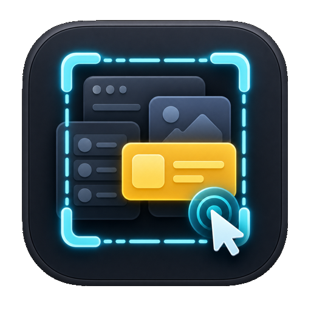

<p align="center">
  
</p>

<h1 align="center">GrabKit</h1>

<p align="center">
  Native UI element grabbing for SwiftUI, UIKit, and AppKit debug builds.
</p>

<p align="center">
  <code>.grabRoot()</code> · <code>.grab("stable.id")</code> · inspect · copy · fix
</p>

GrabKit is a small SwiftPM package for adding React-style element picking to
native Apple apps. Annotate meaningful UI, toggle inspect mode, select an
element, then copy the exact context an engineer or coding agent needs: stable
ID, JSON, XCTest selector, source location, frame, accessibility metadata, app
state, design metadata, and an optional fix request comment.

It is intentionally simple. GrabKit is a debug/internal-build helper, not a
production analytics SDK or private SwiftUI tree scraper.

## What It Does

- Adds a native overlay for picking annotated UI elements.
- Captures stable IDs, source locations, layout frames, accessibility metadata,
  content safety labels, app state, and design metadata.
- Copies individual payloads like ID, JSON, source, and XCTest selectors.
- Copies an agent-ready fix prompt with a selected element and your comment.
- Exposes the current UI graph over an optional local debug HTTP bridge.
- Works across SwiftUI, UIKit, and AppKit with platform-specific code kept small.

## Quick Start

Install `.grabRoot(...)` once near your app shell, then annotate reusable
components or important one-off views.

```swift
import SwiftUI
import GrabKit

@main
struct DemoApp: App {
    var body: some Scene {
        WindowGroup {
            CheckoutScreen()
                .grabRoot(transport: .loopback())
        }
        #if os(macOS)
        .commands { GrabCommands() }
        #endif
    }
}

struct CheckoutScreen: View {
    @State private var isLoading = false

    var body: some View {
        VStack(spacing: 16) {
            Text("Checkout")
                .grab(
                    "checkout.title",
                    role: .text,
                    component: "ScreenTitle",
                    content: .safeText("Checkout")
                )

            Button("Pay now") {
                isLoading = true
            }
            .grab(
                "checkout.payButton",
                role: .button,
                component: "PrimaryButton",
                accessibilityLabel: "Pay now",
                state: ["isLoading": GrabJSONValue.from(isLoading)],
                dataSources: [
                    .observable(
                        "CheckoutView",
                        values: ["isLoading": GrabJSONValue.from(isLoading)]
                    )
                ],
                design: ["token": "button.primary"],
                content: .safeText("Pay now")
            )
        }
        .padding()
        .grabContainer("checkout.root", component: "CheckoutScreen")
    }
}
```

For UIKit or AppKit, call `grab(...)` directly on the view:

```swift
let button = UIButton(type: .system)
button.setTitle("Pay now", for: .normal)
button.grab(
    "checkout.payButton",
    role: .button,
    component: "PrimaryButton",
    state: ["isLoading": false]
)
```

If a UIKit/AppKit view moves after layout, refresh its frame:

```swift
override func layoutSubviews() {
    super.layoutSubviews()
    payButton.grabRefreshFrame()
}
```

## Inspect And Copy

Toggle inspect mode, tap or click a highlighted element, then copy the payload
you need from the selection panel.

- iOS/iPadOS: shake gesture through `GrabInputBridge`.
- iOS/iPadOS with hardware keyboard or Simulator: Command-Shift-D toggles inspect mode; Command-Shift-C clears the current selection.
- macOS SwiftUI: add `.commands { GrabCommands() }`; Command-Shift-D toggles inspect mode and Command-Shift-C clears the current selection.
- Programmatic: `GrabRegistry.shared.toggleInspecting()` on the main actor.

The selected element panel includes quick copy buttons and a `What should change
here?` field. Drag the panel out of the way when it covers UI you want to
select. Use `Copy Prompt` to copy a readable Markdown prompt containing your
comment plus the selected node's metadata and full JSON.
The panel and candidate buttons expose stable accessibility identifiers so
desktop automation tools can drive the inspector directly.

For nested cards, annotate each reusable card or component with a stable ID and
`parentID`. When multiple annotated nodes overlap at the click point, the
selection panel shows the stack so you can switch between the inner element and
its parent cards. Attach observable or model values with `dataSources`; each
`.observable(...)` records the file and line where the data snapshot was added.
Frontmost overlays such as sheets and popovers are prioritized ahead of
obscured content underneath them, while deeper controls inside the overlay can
still win over the overlay container itself.

```swift
RecoveryCard(day: store.currentDay)
    .grabContainer(
        "dashboard.recoveryCard",
        component: "RecoveryCard",
        parentID: "screen.dashboard",
        dataSources: [
            .observable(
                "DashboardStore",
                values: [
                    "currentDay": GrabJSONValue.from(store.currentDay.name),
                    "nextWorkout": GrabJSONValue.from(store.nextWorkout.name)
                ]
            )
        ]
    )
```

## Agent Prompt For Deep App Coverage

Use this prompt when asking a coding agent to add GrabKit coverage to an app:

```text
Add deep GrabKit instrumentation across this app so the inspector can select
real product UI, nested cards/components, and useful state instead of only the
top-level screen.

Requirements:
- Install `.grabRoot(...)` once near the app shell/root scene, behind the
  app's existing debug/internal build gate. Do not enable GrabKit in production.
- If this is a macOS SwiftUI app, add `.commands { GrabCommands() }`.
- Do not annotate every call site blindly. First identify reusable components
  such as cards, rows, buttons, tabs, form fields, empty states, sheets, and
  navigation surfaces, then add `.grab(...)` or `.grabContainer(...)` inside
  those components so coverage comes from the design-system/component layer.
- Add screen and route containers with stable IDs like `screen.dashboard`,
  then use `parentID` on nested cards/rows/controls so copied prompts show a
  useful hierarchy.
- Use stable product IDs, not layout names or indexes. For repeated data, put
  the domain identifier in the GrabKit ID, for example
  `workout.\(workout.id).row`.
- Attach safe observable/model data with `dataSources: [.observable(...)]`.
  Include only values that help debug the UI, such as selected IDs, dates,
  loading/empty/error state, feature flags, computed labels, and model names.
  Do not export secrets, tokens, private user content, or PII unless it is
  explicitly safe and redacted where needed.
- Add `state`, `design`, `accessibilityLabel`, and `content` where they make
  the selected node more useful. Use `.safeText(...)` only for safe visible
  copy; otherwise use `.redacted(reason:)` or omit content.
- For UIKit/AppKit views, call `grab(...)` on the view and make sure moved or
  reused views refresh frames after layout with `grabRefreshFrame()`.
- Keep the implementation simple. Do not add new configuration systems,
  environment variable switches, generated files, or broad abstractions unless
  the app already has a matching pattern.

Acceptance criteria:
- Toggling GrabKit shows selectable nodes for screens, nested cards, rows,
  controls, tab items, and key text/content areas.
- Selecting inside nested UI lets the panel switch between the inner element
  and parent cards via the candidate stack.
- Copy Prompt includes the selected element, parent hierarchy, source location,
  safe state, observable data sources, and relevant design/accessibility data.
- `swift build` and the app's test suite pass. If the app uses XcodeGen or
  another project generator, regenerate before building.
- Update docs or examples that show the app's internal GrabKit integration.
```

## Query From The Development Machine

The HTTP bridge is off by default. For same-Mac macOS apps and iOS Simulator
work, enable loopback explicitly:

```swift
RootView()
    .grabRoot(transport: .loopback(port: 9777))
```

Then query or control inspect mode:

```bash
curl http://localhost:9777/grab/health
curl http://localhost:9777/grab/tree
curl http://localhost:9777/grab/selected
curl "http://localhost:9777/grab/prompt?comment=Make%20this%20clearer"
curl http://localhost:9777/grab/copied
curl -X POST http://localhost:9777/grab/mode -d '{"enabled":true}'
curl -X POST http://localhost:9777/grab/select-point \
  -H 'Content-Type: application/json' \
  -d '{"x":100,"y":200}'
```

### Simulator Clipboard Note

On iOS Simulator, GrabKit copy buttons write to the simulator device pasteboard.
That does not always become the Mac host clipboard automatically, so this is
normal.

Use one of these host-side paths instead:

- Fetch the selected prompt directly:
  `curl "http://127.0.0.1:9777/grab/prompt?comment=Fix%20this" | jq -r '.prompt' | pbcopy`
- Fetch the last copied GrabKit string:
  `curl http://127.0.0.1:9777/grab/copied | jq -r '.value' | pbcopy`
- Or sync the simulator pasteboard to the host explicitly:
  `xcrun simctl pbsync <simulator-udid> host`

For same-LAN physical devices, local-network sharing must be enabled manually
and protected with a session token:

```swift
RootView()
    .grabRoot(transport: .localNetwork(port: 9777, token: "short-lived-token"))
```

Pass the token with `Authorization: Bearer short-lived-token` or
`X-GrabKit-Token`.

## Optional MCP Sidecar

GrabKit includes a macOS-only stdio MCP sidecar that talks to an already enabled
GrabKit transport:

```bash
swift run grabkit-mcp --base-url http://127.0.0.1:9777
GRABKIT_TOKEN=short-lived-token swift run grabkit-mcp --base-url http://iphone.local:9777
```

The sidecar exposes `grab_health`, `grab_tree`, `grab_selected`,
`grab_set_mode`, `grab_select_id`, and `grab_select_point`. It does not make the
app speak MCP and it does not auto-discover devices.

## Package Layout

```text
Sources/GrabKit/Core       Registry, node model, JSON metadata, selection logic
Sources/GrabKit/SwiftUI    SwiftUI modifiers, overlay, frame collection
Sources/GrabKit/Platform   iOS/macOS toggles, clipboard, UIKit/AppKit helpers
Sources/GrabKit/Transport  Tiny debug HTTP server starter
Docs/                      Architecture, integration, remote, security, roadmap
Examples/                  SwiftUI/UIKit/AppKit usage snippets
Tools/                     curl CLI, MCP sidecar, tiny browser viewer
Tests/                     Core registry and prompt formatting tests
```

Start with [Docs/ImplementationGuide.md](Docs/ImplementationGuide.md) for the
recommended integration path.

## Safety

Do not ship GrabKit in production. Compile it out:

```swift
#if DEBUG || INTERNAL_BUILD
import GrabKit
#endif
```

GrabKit can expose real user content, app state, experiment flags, internal IDs,
source locations, and accessibility metadata. Use `GrabContent.redacted(reason:)`
by default for sensitive text, and only mark content as `.safeText(...)` when it
is genuinely safe to export or copy.

## Validation

Run both before completing code changes:

```bash
swift build
swift test
```

Apple-specific files are conditionally compiled and are intended to be opened or
tested in Xcode against iOS/macOS targets when needed.
